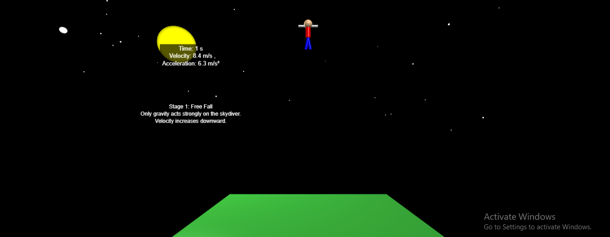

# Physics-Terminal-Velocity-Project
# Terminal Velocity Skydiver Simulation

## Overview
This project models the motion of a skydiver under gravity and air resistance using a 3D simulation built in GlowScript VPython.

The simulation demonstrates how terminal velocity is reached and how parachute deployment affects motion.

---

## Features
- Free fall motion under gravity
- Increasing air resistance (drag force)
- Terminal velocity visualization
- Parachute deployment effect
- Real-time velocity and acceleration display

---

## Simulation Preview

---

## Simulation Link
https://www.glowscript.org/#/user/wakobekele/folder/MyPrograms/program/Skydiverterminalvelocity

---

## Project Structure
- `simulation/` → VPython code
- `report/` → Final PDF report
- `screenshots/` → Key simulation stages
- `presentation/` → Slides

---

## Physics Concepts
- Newton’s Second Law
- Air resistance (drag force)
- Terminal velocity
- Effect of surface area on motion

---

## Author
Wako Bekele Sory and Group Members
